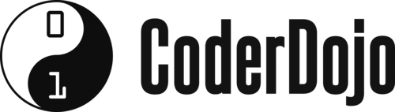

## Apprends les bases de la programmation

### CoderDojo, c'est quoi ?

CoderDojo est une association sans but lucratif née en Irlande qui organise des sessions de cours gratuites (dojo) 
afin d'apprendre les bases de la programmation aux jeunes de 7 à 18 ans.
Les dojos sont toujours conçu sur base volontaire grâce à des organisateurs et coachs bénévoles.

Leur mission est de faciliter le partage de connaissance grâce à un réseau de Dojos.
Il favorisent donc la création de nouveaux Dojos en offrant leur aide.

Un autre objectif de CoderDojo est de donner l'accès à la programmation aux filles, pour cela ils organisent des "Cool Girls Code"
qui est un événement annuel exclusivement réserver aux filles.

D'autres événements spéciaux sont aussi organisés, rendez-vous sur [Les événements spéciaux de CoderDojo](https://www.coderdojobelgium.be/fr/nieuws/speciale-dojos) pour en savoir plus.

### [Page suivante](https://github.com/PaulineRoppe/CoderDojo-Workshop/blob/master/technologies.md)
