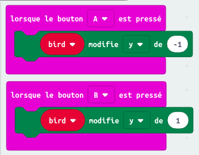
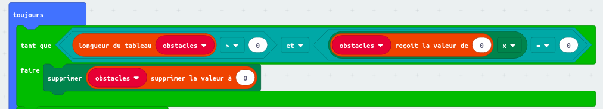
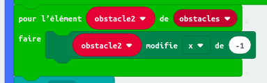
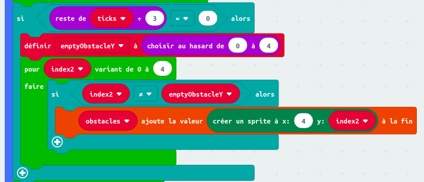
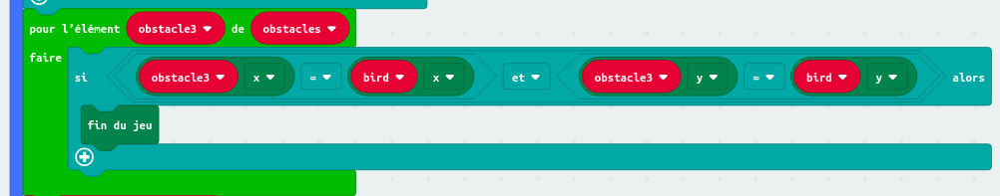
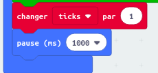
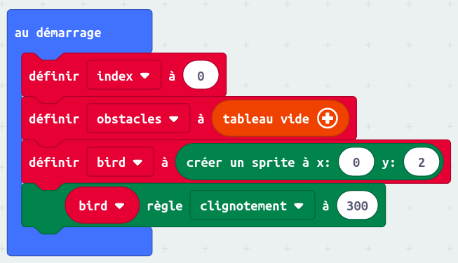

## Apprends les bases de la programmation

### Exercice Micro:bit - CrashyBird

Ce n'est pas vraiment un exercice, mais plutôt un tutoriel à recopier sur [Micro:Bit](https://makecode.microbit.org/#editor) 
Par contre, une fois que tu auras fini de toute recopier, tu peux ajouter le code qui permettra de calculer le score (1 point par mur)

### Code boutons A & B :

### Code "toujours" :

### Code "au démarrage":

### [Retour à la page "technologies"](https://github.com/PaulineRoppe/CoderDojo-Workshop/blob/master/technologies.md)
