## Apprend les bases de la programmation

### Exercice Scratch - Jouer à Pong

(Si vous ne voyez pas le code, vous pouvez cliquer sur l'image et zommer)

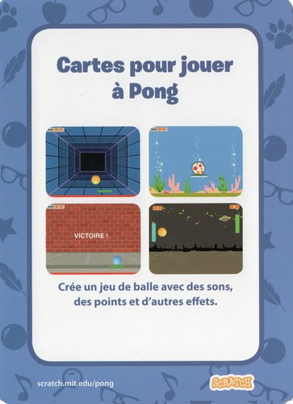 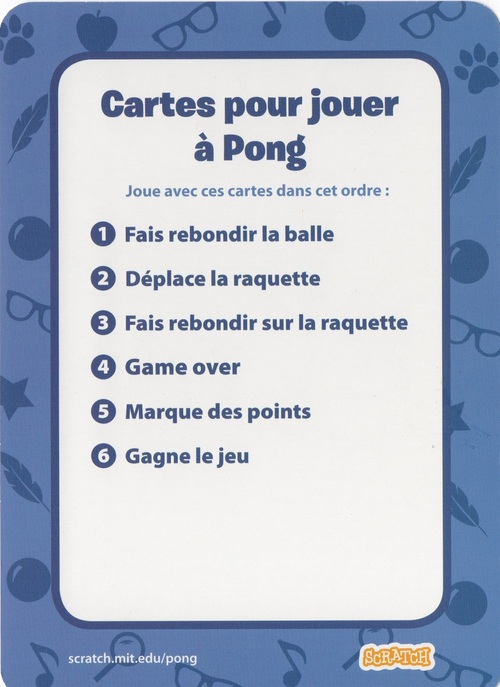

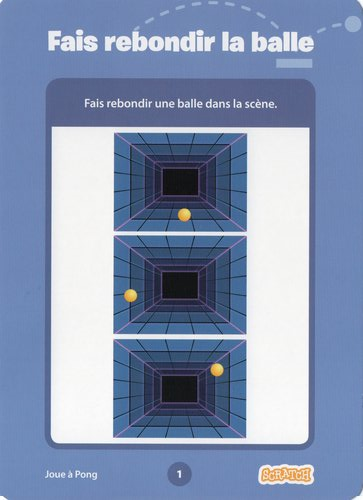 

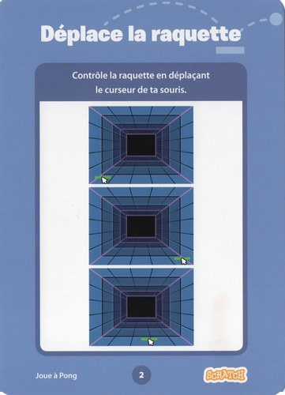 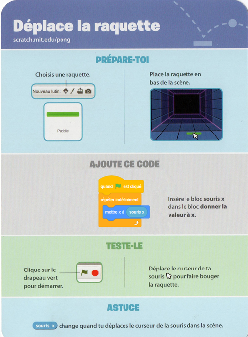

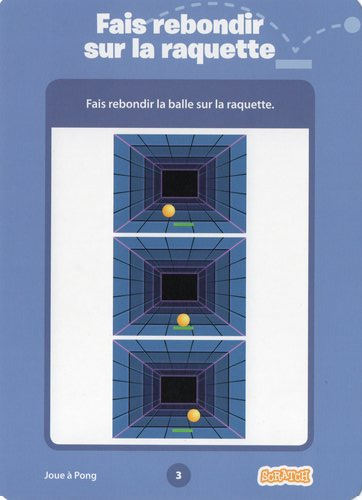 

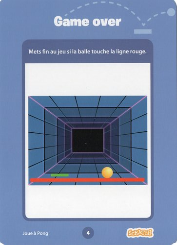 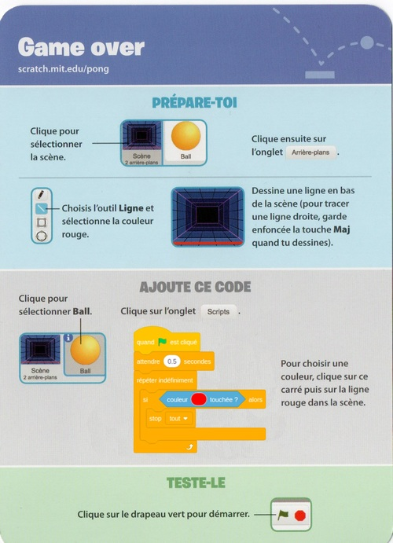

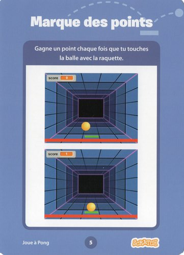 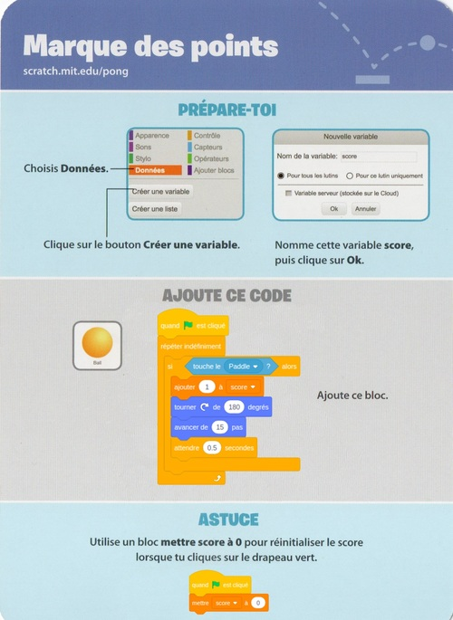

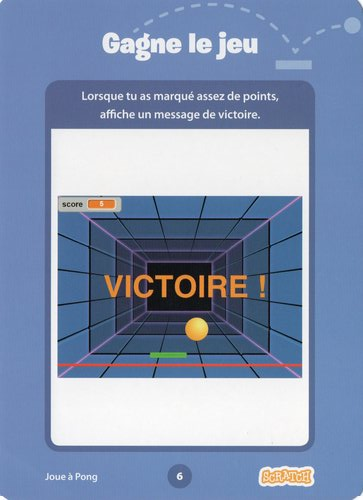 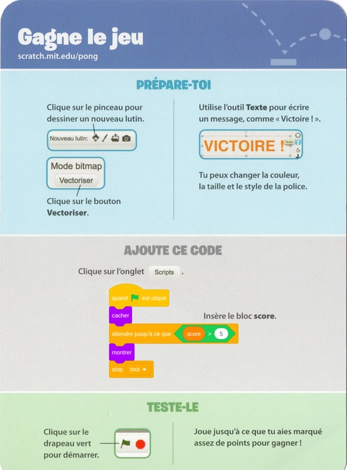

### [Retour à la page "technologies"](https://github.com/PaulineRoppe/CoderDojo-Workshop/blob/master/technologies.md)
