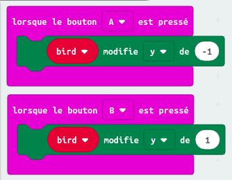

## Apprends les bases de la programmation

### Solution Micro:bit - CrashyBird

### Code boutons A & B :

### Code "toujours":

### Code "au démarrage":

### [Retour à la page "technologies"](https://github.com/PaulineRoppe/CoderDojo-Workshop/blob/master/technologies.md)
