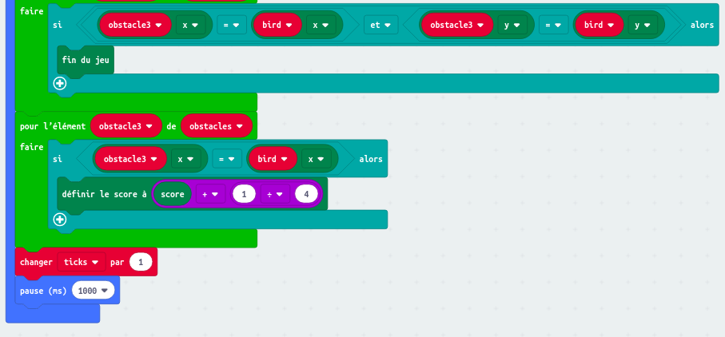

## Apprends les bases de la programmation

### Solution Micro:bit - CrashyBird

### Code à ajouter pour afficher le score : 

### [Retour à la page "technologies"](https://github.com/PaulineRoppe/CoderDojo-Workshop/blob/master/technologies.md)
