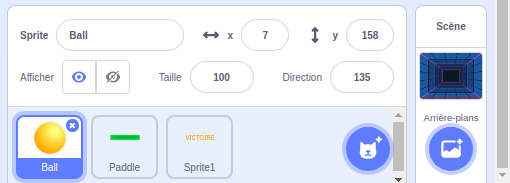
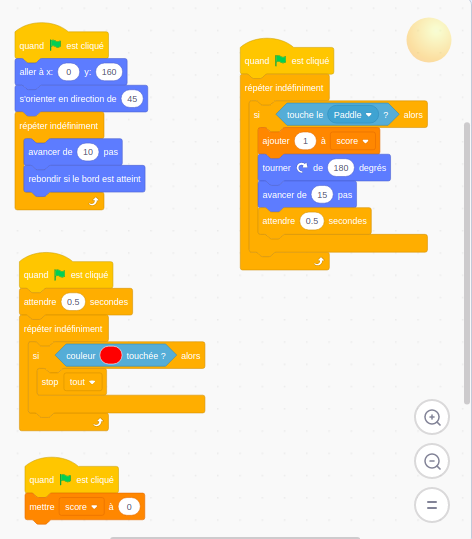
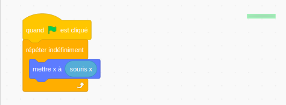
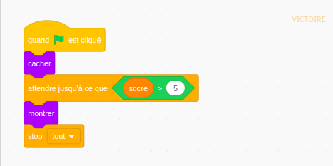

## Apprends les bases de la programmation

### Solution Scratch - Pong

### Les sprites :

### Le code de 'ball' :

### Le code de 'paddle' :

### Le code de 'victoire' :

### [Retour à la page "technologies"](https://github.com/PaulineRoppe/CoderDojo-Workshop/blob/master/technologies.md)
